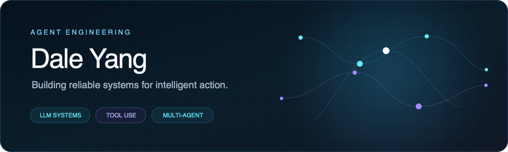
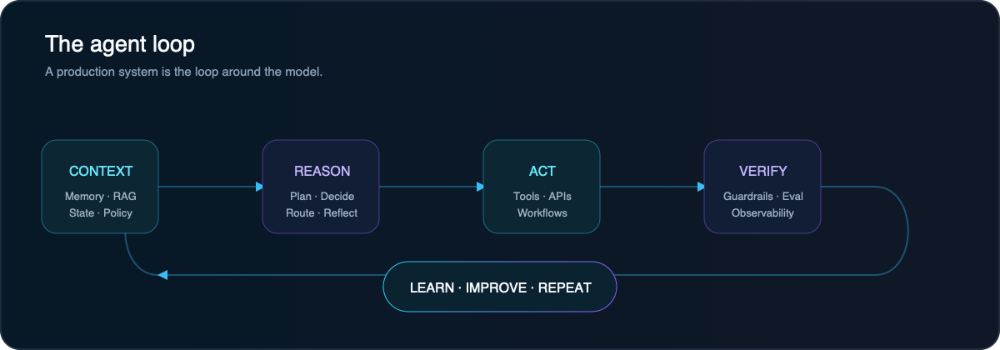
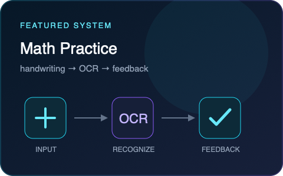
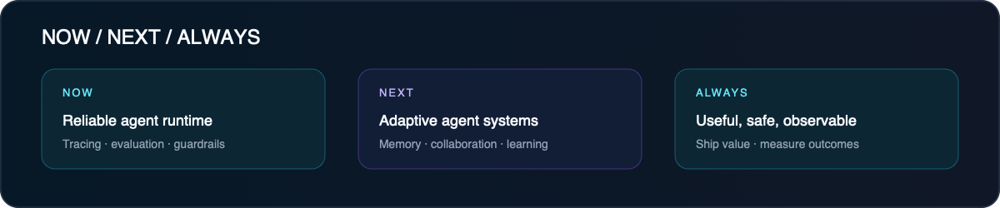

<div align="center">
  
</div>

<br/>

<div align="center">
  <a href="https://github.com/yjd953/yjd953/blob/main/index.md"><b>Engineering Notes</b></a>
  &nbsp;·&nbsp;
  <a href="https://github.com/yjd953?tab=repositories"><b>Projects</b></a>
  &nbsp;·&nbsp;
  <a href="https://github.com/yjd953/yjd953/issues"><b>Guestbook</b></a>
</div>

<br/>

> I build reliable AI agents that can reason, use tools, retrieve knowledge, and finish real-world tasks.

## Profile

Agent Engineer at **ByteDance**, working around production-grade agent systems: orchestration, tool use, retrieval, memory, evaluation, observability, and human-in-the-loop workflows.

```text
FOCUS     Agent Runtime · RAG · Tool Use · Multi-Agent · Evaluation
BUILDING  Reliable systems that turn model capability into shipped products
PRINCIPLE Observable by default · Fail safely · Keep humans in control
```

## Agent engineering map

<div align="center">
  
</div>

## Featured build

<table>
<tr>
<td width="62%" valign="top">

### Math Practice Mini Program

A handwriting-first arithmetic practice experience with OCR-based grading, learning history, mistake review, and an AI learning assistant.

**System highlights**
- Handwriting input and OCR recognition
- Automated grading and mistake review
- Learning history and progress feedback
- AI-assisted learning interactions

[Explore repository →](https://github.com/yjd953/Math-Practice-Mini-Program)

</td>
<td width="38%" valign="top">
  
</td>
</tr>
</table>

## Engineering notes

I use the blog as a public engineering notebook: fewer hot takes, more system diagrams, trade-offs, failure modes, and reusable checklists.

| Note | What it covers |
|---|---|
| [From Demo to Production: Four Reliability Pillars for Agents](https://github.com/yjd953/yjd953/blob/main/posts/agent-reliability.md) | Control loops, state, tools, evaluation, and observability |
| [A Practical Tool-Use Checklist](https://github.com/yjd953/yjd953/blob/main/posts/tool-use-checklist.md) | Contracts, permissions, idempotency, retries, and verification |
| [Open the full notebook](https://github.com/yjd953/yjd953/blob/main/index.md) | All essays, notes, and future experiments |

## Current operating system

<div align="center">
  
</div>

## Activity

<div align="center">
  <picture>
    <source media="(prefers-color-scheme: dark)" srcset="https://raw.githubusercontent.com/yjd953/yjd953/output/github-snake-dark.png" />
    <source media="(prefers-color-scheme: light)" srcset="https://raw.githubusercontent.com/yjd953/yjd953/output/github-snake.png" />
    
  </picture>
</div>

<details>
<summary><b>How I think about production agents</b></summary>
<br/>

1. **A model is a component, not the system.** State, permissions, tools, fallbacks, and observability define the product.
2. **Every tool call is a transaction.** Validate inputs, constrain effects, preserve idempotency, and verify outputs.
3. **Evaluation is part of development.** Offline suites, online signals, trace review, and regression gates must work together.
4. **Human control is a feature.** High-impact actions need clear boundaries, checkpoints, and reversible execution.

</details>

---

<div align="center">
  <sub>Building agents that do useful work — reliably.</sub>
  <br/><br/>
  <a href="https://github.com/yjd953/yjd953/issues/new?title=Hello%20Dale"><b>Start a conversation</b></a>
  &nbsp;·&nbsp;
  <a href="https://github.com/yjd953"><b>Follow on GitHub</b></a>
</div>
